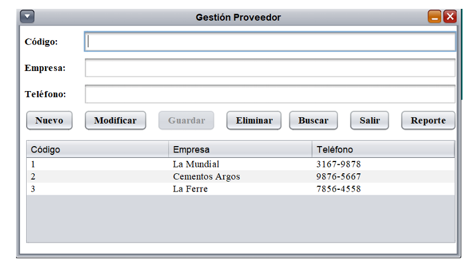
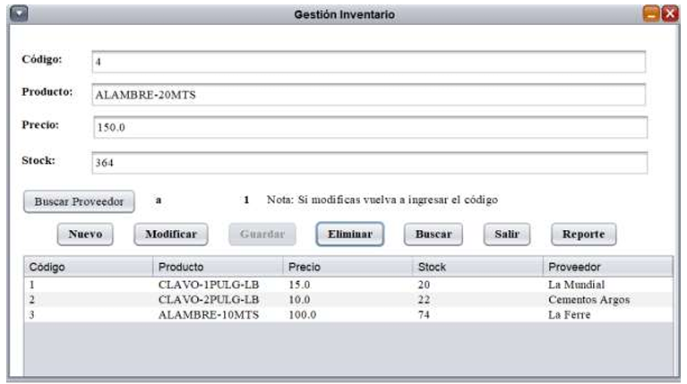
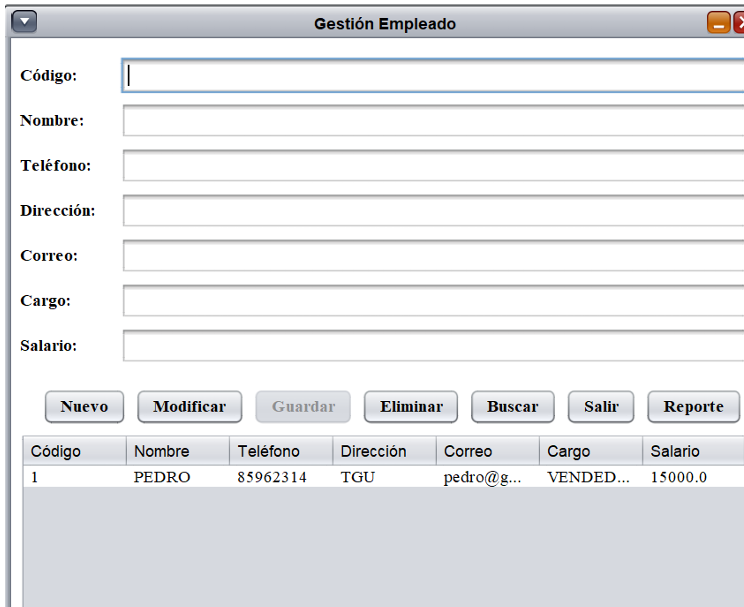
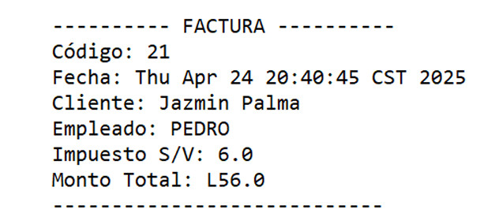

Sistema de escritorio para la gestión de un punto de venta en una ferretería, con las siguientes funcionalidades:

# Gestión de proveedores

# Gestión de inventario

# Gestion de Empleados

# Gestión de ventas

# Carrito de compras

# Gestión de pagos

# Gestión de facturas

# Generación de reportes

# 🎯 Mi Aporte

Desarrollé la sección de gestión de ventas y parte de la sección de generación de factura, implementando un árbol binario de búsqueda autobalanceable (rellenado por niveles) para optimizar el tiempo de ejecución en la búsqueda de productos por parte del usuario.

***

# 📦 Requerimientos

- **Java 21 en adelante**
- **JDK 21 minimo**

# Clona este repositorio
https://github.com/Angel12328/ferreteriaJava.git

***

# Colaboradores
Proyecto realizado por: Angel Zavala, Byron Torres, Jeimy Palma y Allan Orellana.

